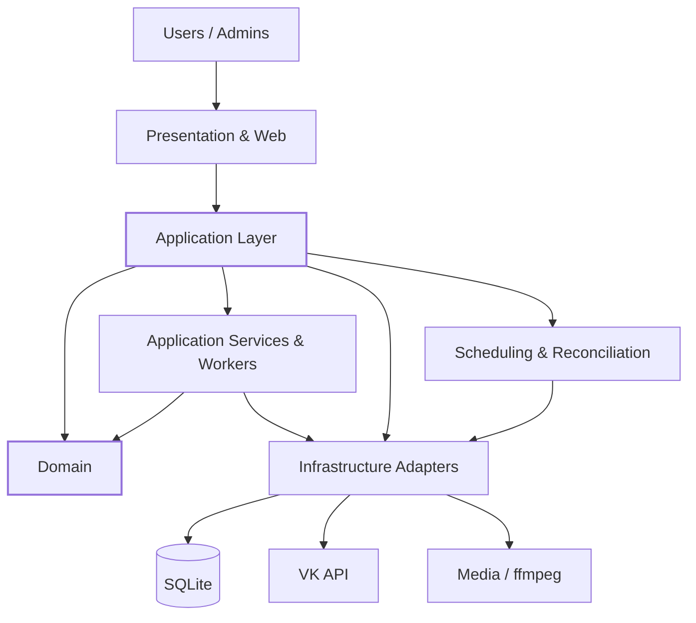

# Orion — Backend Architecture Case Study

> Private production-oriented project. The source code and sensitive business rules are intentionally not public.

**Role:** Backend Developer / System Designer  
**Core stack:** Python 3.12 · FastAPI · Uvicorn · SQLite · Docker · VK API · pytest · httpx · ffmpeg

## Overview

Orion is a modular backend platform for automating the lifecycle of user-generated content in a social publishing environment.

The system coordinates multiple workflows including content intake, moderation, publication planning, scheduling, background processing, external API communication, media handling and post-publication operations.

The project is designed around explicit domain boundaries rather than transport-specific handlers. Business rules are separated from external APIs and persistence concerns so that workflows can evolve without coupling the core system to a particular delivery mechanism.

## Architecture

The dependency direction keeps domain decisions independent from VK, HTTP transport and persistence details.

### Domain

Contains domain models, states and business concepts independent from external APIs.

### Application

Contains use cases, policies, workflow orchestration and contracts between the business layer and infrastructure.

### Infrastructure

Implements persistence and communication with external systems.

### Presentation / Web

Handles incoming interactions and HTTP-facing functionality without owning core business rules.

### Composition

Application composition modules assemble concrete implementations and keep dependency wiring outside domain logic.

## Engineering Challenges

### Reliable publication scheduling

Publication is not treated as a simple delayed task. The system has to coordinate content with different eligibility constraints and priorities while remaining correct when the external platform changes independently of the application.

The scheduling model therefore separates business eligibility from publication execution and treats persisted application state and external state as potentially divergent.

### External-system reconciliation

External systems can be modified outside Orion. Scheduled content may disappear, change state or be published independently.

The architecture is designed so that external state can be reconciled with internal state instead of assuming that every transition originated inside the application.

### Predictable state transitions

Long-lived content moves through multiple stages before and after publication. Explicit state transitions make those workflows observable and prevent transport handlers from silently becoming the source of business logic.

### Background processing

Long-running and deferred operations are isolated from interactive request handling. Background workers coordinate tasks such as publication-related processing and award delivery while application services retain the business decisions.

### Idempotent workflows

Operations that may be retried are designed around stable state and explicit eligibility checks. The goal is to make retries safe and reduce the risk of duplicate side effects when workers restart or external calls fail.

### Media processing

The platform handles media-oriented workflows in addition to textual content. Media processing is kept behind application/infrastructure boundaries and the runtime image includes ffmpeg for media operations.

### Maintainability

The system favors small domain-specific modules over a single large service layer. Features such as publication, content lifecycle and award workflows are represented by dedicated application modules with their own models, policies, contracts, services and workers where appropriate.

## Testing Strategy

The project uses pytest for automated testing and httpx for HTTP-oriented tests.

The architecture also makes business policies testable independently from external VK communication by keeping domain/application behavior behind explicit boundaries.

## Deployment

Orion is packaged as a Docker container based on Python 3.12 slim.

The production image installs only runtime dependencies, includes ffmpeg for media processing and runs the application as a dedicated non-root user.

## What This Project Demonstrates

- Backend system design beyond CRUD applications
- Clean separation of domain, application and infrastructure concerns
- Complex workflow and state-machine thinking
- External API integration and failure-aware design
- Background processing and scheduling
- Reconciliation with independently changing external state
- Retry-safe and idempotency-oriented workflow design
- Dockerized Python services
- Automated backend testing
- Maintaining a growing modular codebase

## Confidentiality

The complete Orion repository remains private. This case study intentionally describes architectural decisions at a high level and excludes credentials, production data, proprietary business rules, internal identifiers and production source code.
