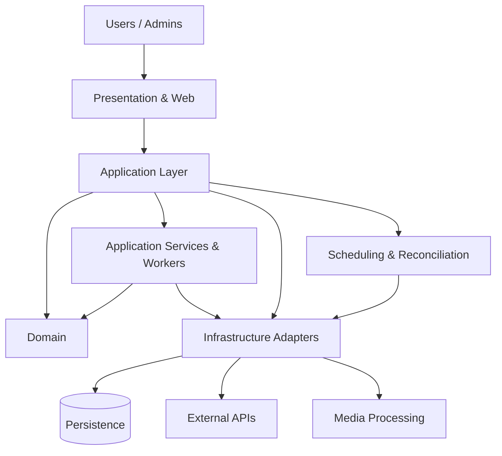

# Orion — Backend Architecture Case Study

> Private production-oriented project. The source code and sensitive business rules are intentionally not public.

**Role:** Backend Developer / System Designer  
**Core stack:** Python 3.12 · FastAPI · Uvicorn · SQLite · Docker · VK API · pytest · httpx · ffmpeg

## Overview

Orion is a modular backend platform for automating the lifecycle of user-generated content in a social publishing environment.

The system coordinates multiple workflows including content intake, moderation, publication planning, scheduling, background processing, external API communication, media handling and post-publication operations.

The project is designed around explicit domain boundaries rather than transport-specific handlers. Business rules are separated from external APIs and persistence concerns so that workflows can evolve without coupling the core system to a particular delivery mechanism.

## Architecture

The dependency direction keeps domain decisions independent from external APIs, transport and persistence details.

## Engineering Principles

### Domain boundaries over transport handlers

Core decisions are kept inside application/domain layers rather than being embedded in API handlers or integrations.

### Explicit workflows and state transitions

Long-lived operations are represented through explicit lifecycle states. This makes behaviour observable, testable and recoverable after interruptions.

### External state reconciliation

External platforms may change independently from Orion. The system treats external state as something that must be observed and reconciled rather than blindly assumed to match internal state.

## Engineering Challenges

### Reliable publication scheduling

Publication is not treated as a simple delayed task. Scheduling combines eligibility rules, priorities and persisted state while accounting for external platform changes.

The design separates planning from execution so that decisions remain testable and observable.

### Failure-aware integrations

External APIs can fail, return unexpected states or complete actions outside the application's own process. Integration boundaries are designed around validation, reconciliation and safe retries.

### Idempotent workflows

Operations that may be repeated are protected by explicit state checks and stable identities. The goal is to make retries safe after worker restarts or partial failures.

### Background processing

Deferred and long-running operations are isolated from interactive flows. Workers perform processing while application services retain business decisions.

### Media workflows

The platform supports media-oriented content flows. Media processing is isolated behind application/infrastructure boundaries and uses ffmpeg where required.

## Reliability & Recovery

Production systems need predictable behaviour not only during successful execution, but also during interruptions.

The architecture includes patterns for:

- recovering worker processes after restart;
- validating persisted state before continuing workflows;
- separating external reconciliation from internal decisions;
- avoiding duplicate side effects during retries;
- keeping operational monitoring separate from business logic.

## Observability & Operations

A separate read-only monitoring service is maintained for operational visibility.

The monitoring layer follows an **observer, not controller** principle:

- reads service and health state;
- observes logs and failures;
- reports operational information;
- does not mutate application data or control production workflows.

## Testing Strategy

The project uses pytest for automated testing and httpx for HTTP-oriented tests.

Testing focuses on:

- business policies independent from external APIs;
- lifecycle and state transition correctness;
- retry-safe behaviour;
- integration boundaries;
- regression protection for complex workflows.

## Deployment

Orion is packaged as a Docker-based Python service.

The production image uses Python 3.12, runtime dependencies only, ffmpeg for media operations and a dedicated application runtime configuration.

## What This Project Demonstrates

- Backend system design beyond CRUD applications
- Clean separation of domain, application and infrastructure concerns
- Complex workflow and state-machine thinking
- External API integration and failure-aware design
- Background processing and scheduling
- Reconciliation with independently changing external state
- Retry-safe and idempotency-oriented workflow design
- Dockerized Python services
- Automated backend testing
- Operational thinking after deployment

## Confidentiality

The complete Orion repository remains private.

This case study intentionally describes architectural decisions at a high level and excludes:

- credentials and secrets;
- production data;
- customer-specific business rules;
- internal identifiers;
- infrastructure details;
- production source code.
